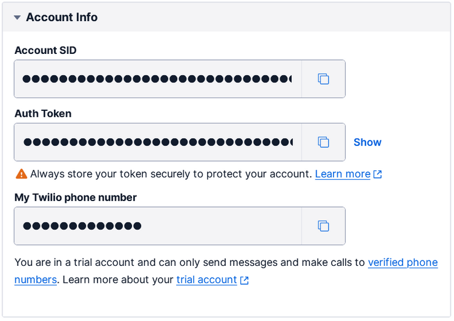
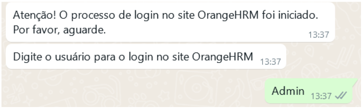

# bot-orange
Automação para acesso ao OrangeHRM via credenciais fornecida por WhatsApp

## Requisitos
- Python 3.8^
- pip
- Virtualenv (opcional)

## Como usar
Abaixo os passos para executar o projeto.

- Clone o repositório
- Crie e ative um ambiente virtual
- Instale as dependências
- Busque as credenciais da Twilio
- Atribua as credenciais da Twilio a variáveis de ambiente
- Execute o projeto

```bash
python bot.py
```

## Credenviais da Twilio

Acesse o site da [Twilio](https://www.twilio.com/), crie uma conta e ative o whatsapp sandbox.

Coloque as credenciais como variáveis de ambiente ou em um arquivo de configuração (alterando no código).



## Mensagens
O processo enviará mensagens para o número de telefone definido, emitindo alerta sobre o inicio do processo, solicitando o usuário e senha, e informando o sucesso ou falha do processo.




